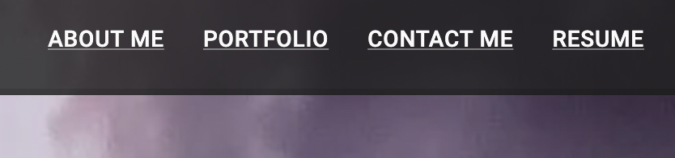
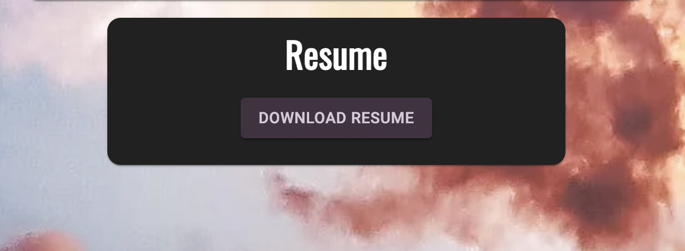
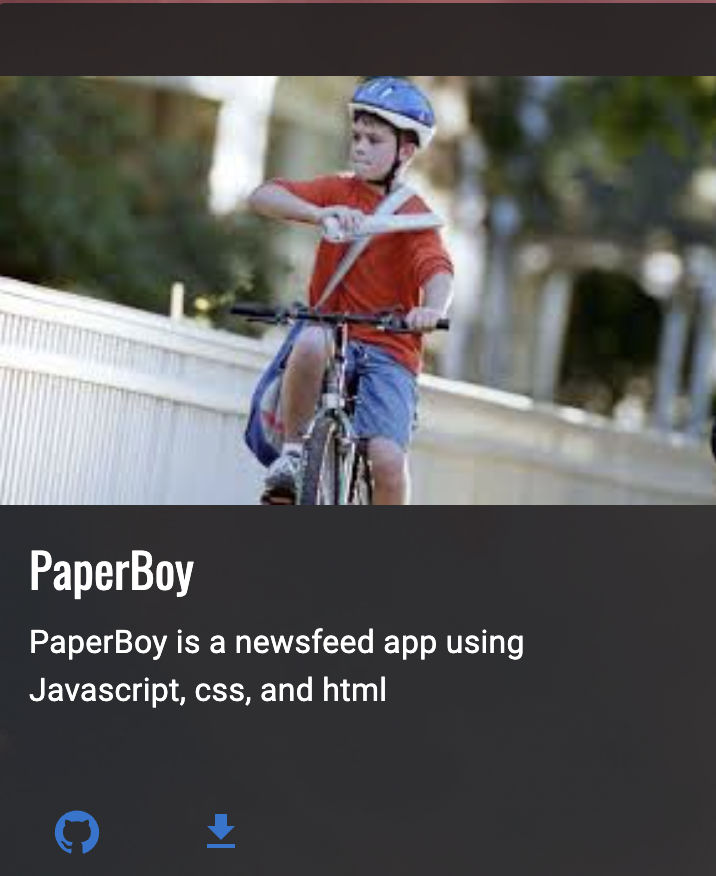

# *** Progressive-Web-Applications- ***
[GitHub Repository](https://github.com/scarfrae/react-portfolio)

[Deployed Application](https://scarfrae.github.io/react-portfolio/)

<!-- deployed application -->
## **Description** 📚

*react-portfolio * is my project portfolio including a about me page, a portfolio page, a contact me page, and a resume page. It was created via react.

## **Table of Contents** 📄

* Installation
* Usage
* License
* Contributing
* Testing
* Technology
* Questions

---

## **Installation** ⚙️

Visit my [repository](https://github.com/scarfrae/react-portfolio) to reference: any materials and my process in developing the web page. Visit my [Deployed Application](https://scarfrae.github.io/react-portfolio/) to use the webpage.

### **Usage** 💻
* Users can interact with each page via the navbar at the top

* They can view my resume by pressing it (it will download onto their computer)

* They can view my project's githubs or deployed pages by pressing the respective buttons at the bottom left corner of each card

### **License** 💳

MIT License

Copyright © 2022

Permission is hereby granted, free of charge, to any person obtaining a copy of this software and associated documentation files (the "Software"), to deal in the Software without restriction, including without limitation the rights to use, copy, modify, merge, publish, distribute, sublicense, and/or sell copies of the Software, and to permit persons to whom the Software is furnished to do so, subject to the following conditions:

The above copyright notice and this permission notice shall be included in all copies or substantial portions of the Software.

THE SOFTWARE IS PROVIDED "AS IS", WITHOUT WARRANTY OF ANY KIND, EXPRESS OR IMPLIED, INCLUDING BUT NOT LIMITED TO THE WARRANTIES OF MERCHANTABILITY, FITNESS FOR A PARTICULAR PURPOSE AND NONINFRINGEMENT. IN NO EVENT SHALL THE AUTHORS OR COPYRIGHT HOLDERS BE LIABLE FOR ANY CLAIM, DAMAGES OR OTHER LIABILITY, WHETHER IN AN ACTION OF CONTRACT, TORT OR OTHERWISE, ARISING FROM, OUT OF OR IN CONNECTION WITH THE SOFTWARE OR THE USE OR OTHER DEALINGS IN THE SOFTWARE.

### **Testing** 📝
All testing was done by the developing team.

### **Technology** 💡
* React
* Github Pages
* Javascript
* HTML
* CSS
* NodeJs
* Vscode

### **Contact** ☎
* Sterling Cafrae **-** [Github](https://github.com/scarfrae)**,** [LinkedIn](https://www.linkedin.com/in/sterling-carfrae-a2a8151a5/)
...
***
